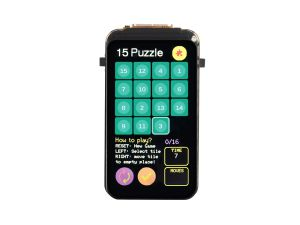

# Air Quality Station for Indoor use only

This is the project for Air Quality Monitoring device.

This device should report following information:
- CO2 ppm measurement
- temperature
- humidity
- atmospheric pressure
- AQI
- staistics

The main functionality:
- save all measurements into the local SD card database
- draw different graphs for each sensor measure history statistics at OLED display
- integrate all sensors in Home Assistant if the device is connected to WiFi and HA is added
- start Wifi in `AP mode` with `captive_portal` modified to show all measures and `js` graphs

# Hardware

## Board

`ESP32 C6` with OLED 1.47 from [Waveshare](https://www.waveshare.com/wiki/ESP32-C6-LCD-1.47)

## CO2

`SDC41` CO2 sensor (generic from Ali) [Official link](https://sensirion.com/products/catalog/SCD41)

# Temperature, humidity, pressure

`BME680` Generic sensor from Ali [ESPHome doc](https://esphome.io/components/sensor/bme680.html)

# Etc

Some other stuff for battery power and casing is needed.

# Help

Saving space and move setup instructions and how to [here](doc/README.md):

Example setup based on official demo with LVGL and graphics from Square Line Studio: https://github.com/trianglesis/ESP32-C6-LCD-1.47-Test-LVGL

# End