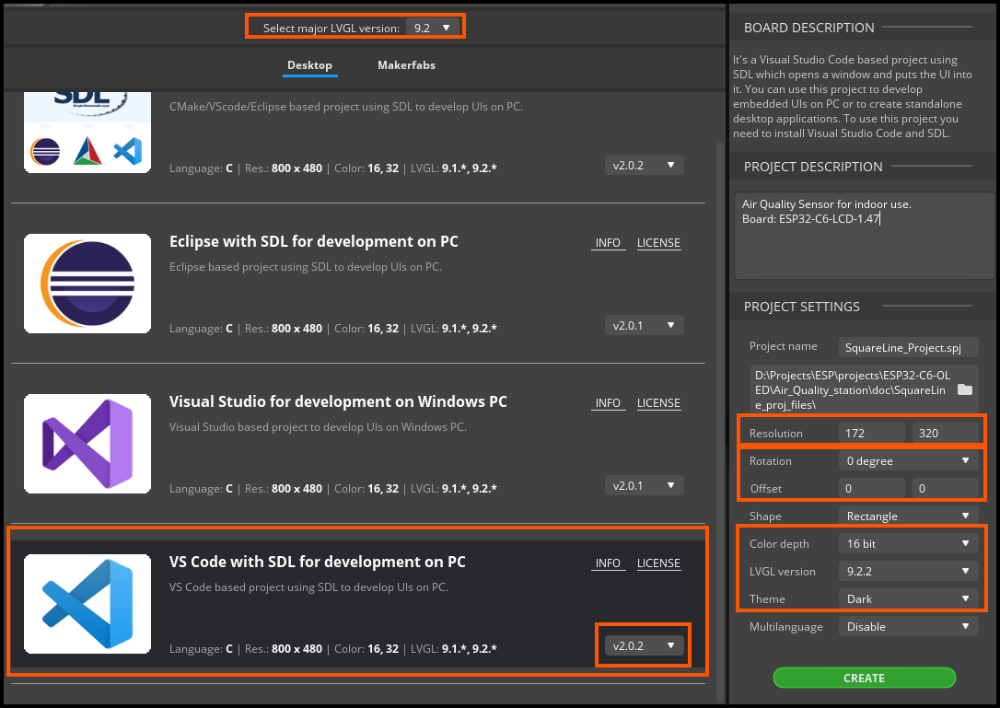
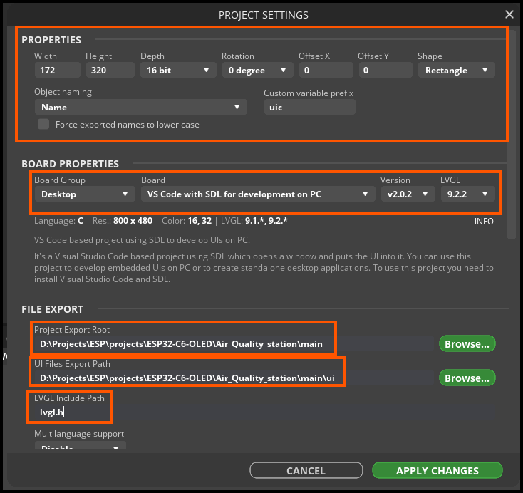
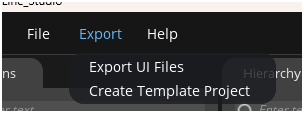

# Setup

All steps and problems will keep here.

How to BASICS for a very begginer is also [here](how_to_basics/README.md)
I will add there my walkthrough with all details

## Changing most common options.

Make partitions larger by default, utilize all 4Mb is SPI flash.

- Use `menuconfig` to change default flash size. (`ESPTOOLPY_FLASHSIZE`)
- Copy example `partitions.csv` into the project root and just change the last value to `3512K`
- Use `menuconfig` and set pertitions to custom csv. (`PARTITION_TABLE_TYPE`)
- Use `menuconfig` set HTTP header limit to `1024`. (`HTTPD_MAX_REQ_HDR_LEN`)
  - Later to accept mobile browsers UserAgent long string at captive portal
- Optionally change log level under `LOG_DEFAULT_LEVEL`
- Optionally change log level under `LOG_MAXIMUM_LEVEL`

- LATER: Add more setup options to save time, like SD Card flash setup, WiFI and etc


## Add modules

All modules from component req:
- `idf.py add-dependency "espressif/led_strip^3.0.1"`
- `idf.py add-dependency "lvgl/lvgl^9.2.2"`
- `idf.py add-dependency "joltwallet/littlefs^1.19.1"`


### LVGL

Adding LVGL lib as IDF submodule: 

- `idf.py add-dependency "lvgl/lvgl^9.2.2"`

Use [lvgl_conf_template.h](../managed_components/lvgl__lvgl/lv_conf_template.h) as template for `lvgl_conf.h`

Copy template file to upper directory:

```text
{PROJ_ROOT}/managed_components/lvgl__lvgl/..
{PROJ_ROOT}/managed_components/lvgl_conf.h
```

Modify `lvgl_conf.h` and change 0 to 1

```code
#if 0 /*Set it to "1" to enable content*/
```

Remember to check this section and enable all fonts you need!

```text
/*==================
 *   FONT USAGE
 *===================*/

/* Montserrat fonts with ASCII range and some symbols using bpp = 4
 * https://fonts.google.com/specimen/Montserrat */
#define LV_FONT_MONTSERRAT_8 1
```

Clean the build `Full clean` and run `menuconfig` option again.
- It should now go into LVGL dir and collect all options there.


- Use `menuconfig` set LVGL option `LV_CONF_SKIP` to not skip custom `lvgl_conf.h`! (actually can build without custom lv_conf.h)
- Check if color depth = 16
- Check `Font usage` - optional if you use more fonts
- Go to `Devices` - check box for `LV_USE_ST7789` (actually does not mater)
- Examples: disable, do not build.
- Themes: (optional) you can select default theme. (I have not change anything yet)

Can now run build, just to check, not flash.

#### Extras

Check float enabled, or UI will not show you float numbers.

`LV_USE_FLOAT`

Gradient is not working, check:

`LV_USE_DRAW_SW_COMPLEX_GRADIENTS 1`

Doesn't work yet


### Led

- `idf.py add-dependency "espressif/led_strip^3.0.1"`

And follow usual setup


### Square Line Studio

We can use [Square Line](https://docs.squareline.io) to draw graphics for us!


Create new project: 

- Choose `VS Code with SDL`
- Set screen dimensions according to the hardware.
- No rotations yet.
- Color `16 bit`.
- LVGL `9.2.2` - should be the same as loaded from `IDF Component Library`
- Dark by defaut is good to have
- Select dir to save the project, I use this repo

Create new project and open `File` -> `Project Settings` after.



Set `File Export` paths:

- Root as `{PROJECT_ROOT}/main/`
- UI as `{PROJECT_ROOT}/main/ui`
- Check `lvgl.h` should use direct path, as we using lvgl from IDF components, it will be initialized at root.
  - The file `ui.h` after exporting UI from SQ Line Studio will have this direct import: `#include "lvgl.h"`

Here you can change options and rotate UI. 
- You should also rotate the display in `lvgl_init` as explained in this [topic](https://forum.lvgl.io/t/gestures-are-slow-perceiving-only-detecting-one-of-5-10-tries/18515/101)

Exporting - no need to use `flat export`, run as default:




Modify the `main\CMakeLists.txt`

I used the approach from this [example](https://github.com/serdartoren/ESP32-S3_HMI_Squareline_Example/blob/main/main/CMakeLists.txt)

```text
# https://github.com/serdartoren/ESP32-S3_HMI_Squareline_Example/blob/main/main/CMakeLists.txt

# Add sources from ui directory
file(GLOB_RECURSE SRC_UI ${CMAKE_SOURCE_DIR} "ui/*.c")

idf_component_register(SRCS "main.c"  
                              ${SRC_UI}
                    INCLUDE_DIRS "." 
                                 "ui"
                       )
```

Modify the project `main.c`
- Add subdir import of exported graphics: `#include "ui/ui.h"`


### SD Card

- [SD SPI](https://docs.espressif.com/projects/esp-idf/en/stable/esp32/api-reference/peripherals/sdspi_host.html)

Setup first code carcass based on example (from waveshare), read the doc, use another example to add wearing funcs:
- [IDF Example](https://github.com/espressif/esp-idf/blob/master/examples/storage/sd_card/sdmmc/main/sd_card_example_main.c)
- [IDF Example as file_serving](https://github.com/espressif/esp-idf/blob/4c2820d377d1375e787bcef612f0c32c1427d183/examples/protocols/http_server/file_serving/main/main.c)
- [Waveshare example SD_SPI.c](https://github.com/trianglesis/ESP32-C6-LCD-1.47-Test-LVGL/blob/c95cb298858690e018c0155daccdb1463647a111/main/SD_Card/SD_SPI.c)

But first!

Use Waveshare default example where it prints SD Card size, to validate the SD Card itself and board integrity!
I have a fault SD card port at one of the boards, checking it beforehand can save you a lot of time!

#### Service files

`idf.py add-dependency "joltwallet/littlefs^1.19.1"`

It required to have an SPI flash storage to host initial webserver files to enable upload to SD Card after.
Use examples like:
- [IDF Example file serving](https://github.com/espressif/esp-idf/blob/4c2820d377d1375e787bcef612f0c32c1427d183/examples/protocols/http_server/file_serving/README.md)
- [My example of web server but no upload](https://github.com/trianglesis/webserver-w-ap-portal-dns-redirect/blob/3c77dccb4fd825f2f68bc036e616b9afba420bd2/README.md)

See [LittleFS](how_to_basics/README.md#littlefs)

### WebServer

Check `LWIP_MAX_SOCKETS`

We should have now two storages ready:

- `littlefs` - to store initial html files, for web server to render upload file page.
- `SD card` - to store all new files uploaded or where to write logs

We need to create a web view for page to upload files, but only render the main page `/` index.html from sd card.
- Initially, there is no html page at root, or, maybe we need to put there a placeholder html with just a redirect?

Reuse my setup from [Wifi AP](https://github.com/trianglesis/webserver-w-ap-portal-dns-redirect/blob/3c77dccb4fd825f2f68bc036e616b9afba420bd2/components/access_point_wifi/access_point_wifi.c) or use IDF example as the same way

Then use example file server, which is good enough already: [file](https://github.com/espressif/esp-idf/blob/4c2820d377d1375e787bcef612f0c32c1427d183/examples/protocols/http_server/file_serving/main/file_server.c)


NOTE: I have not yet get the part work, where it shows an HTML page with all files!
Now works.

### Webserver + FS + SPI + SD Card

The working idea is following:

Start WEB server with small `index.html` stored and served from `littlefs` - local SPI flash.
Open upload to place a new `index.html` and everything needed: css, js, etc to SD Card
Now serve the site page from SD Card, instead of SPI Flash

The struggle is [here](how_to_basics/README.md#file-serving)

It's now working:

```shell
# Upload new index.html file from sd_card directory from current repo
curl -X POST --data-binary @index.html http://192.168.1.225:80/upload/index.html
File uploaded successfully

# New added replace ARG
curl -X POST --data-binary @index.html http://192.168.1.225:80/upload/index.html?replace=1

# Delete
curl -X POST  http://192.168.1.225:80/delete/index.html?replace=1
```

And check web `/` to see  `This is SD card web page`

# Sensors


## CO2 SCD41

Check different drivers:
- https://esp-idf-lib.readthedocs.io/en/latest/groups/scd4x.html
- https://github.com/Sensirion/embedded-i2c-scd4x/tree/master#

`https://github.com/Sensirion/embedded-i2c-scd4x`

- `idf.py add-dependency "lvgl/lvgl^9.2.2"`
- `git submodule add https://github.com/Sensirion/embedded-i2c-scd4x.git components/scd4x`

- [More](how_to_basics/README.md#scd4x)

## Air temp, humid, bme680

https://github.com/UncleRus/esp-idf-lib

# Links, help, forums and etc

Use this list to get more info about each step here and all possible workarounds.

- [Waveshare](https://www.waveshare.com/wiki/ESP32-C6-LCD-1.47)

- [LVGL](https://docs.lvgl.io/9.2/overview/index.html)
  - [Widgets](https://docs.lvgl.io/9.2/API/widgets/index.html)
- This [topic](https://forum.lvgl.io/t/gestures-are-slow-perceiving-only-detecting-one-of-5-10-tries/18515/101) helped me a lot to understand the proper LCD driver setup and display rotation and colors.
  - The [post](https://forum.lvgl.io/t/gestures-are-slow-perceiving-only-detecting-one-of-5-10-tries/18515/59) about display setup.
  - The [post](https://forum.lvgl.io/t/gestures-are-slow-perceiving-only-detecting-one-of-5-10-tries/18515/60) about rotation.
  - Fix rotated display dead zones [post](https://forum.lvgl.io/t/gestures-are-slow-perceiving-only-detecting-one-of-5-10-tries/18515/86)
  - Fix display invertion [post](https://forum.lvgl.io/t/lvgl-9-2-2-esp32-c6-lcd-1-47-idf-5-4-1-st7789v3/20871)

- This [repo](https://github.com/serdartoren/ESP32-S3_HMI_Squareline_Example) helped me to understand `Square Line Studio` expoting and compiling.